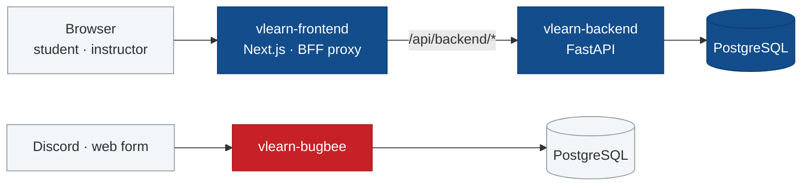

<picture>
  <source media="(prefers-color-scheme: dark)" srcset="https://raw.githubusercontent.com/vinuni-vlearn/.github/main/profile/assets/banner-dark.svg">
  
</picture>

VLearn is VinUniversity's adaptive-learning web application, built for the
**AI In Action** programme. Learning is organised by published learning day: a
student opens today's day, works through its materials and assessment, and the
tutor adapts to what they have actually mastered.

## What VLearn does

<picture>
  <source media="(prefers-color-scheme: dark)" srcset="https://raw.githubusercontent.com/vinuni-vlearn/.github/main/profile/assets/features-dark.svg">
  
</picture>

Placement Assessment runs once per course and stays skippable. Every day carries
one post-class assessment plus targeted drills. Student identity always comes
from the server session — never from a role or email supplied by the interface.

## How it fits together

The browser never talks to the API directly. Every authenticated call crosses the
same-origin BFF proxy in the frontend, which keeps the session cookie boundary
intact; Bedrock, S3 and SES sit behind hexagonal ports with mock adapters for
local development. Bug reports take their own path: they arrive through BugBee
and never touch the learning database.

Across all four repositories, `vlq` in **vlearn-quality** runs one quality gate
with the same commands each repository's CI runs — and counts a skipped check as
a failure.

## Repositories

<picture>
  <source media="(prefers-color-scheme: dark)" srcset="https://raw.githubusercontent.com/vinuni-vlearn/.github/main/profile/assets/repo-cards-dark.svg">
  
</picture>

[vlearn-frontend](https://github.com/vinuni-vlearn/vlearn-frontend) ·
[vlearn-backend](https://github.com/vinuni-vlearn/vlearn-backend) ·
[vlearn-bugbee](https://github.com/vinuni-vlearn/vlearn-bugbee) ·
[vlearn-quality](https://github.com/vinuni-vlearn/vlearn-quality)

> [!NOTE]
> Every repository is private while VLearn is in pilot, so those links resolve
> only for members of this organisation.

---

VinUniversity · [vlearn.dev](https://vlearn.dev)
